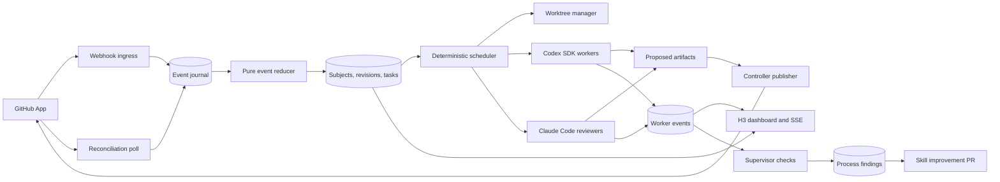

# CEO Strategic Review: wolfstar-github-agent

Status: proposed architecture. This document makes no implementation changes.

## 1. Nuclear scope challenge

**Premise:** [GitHub](https://github.com) maintenance repeats the same discovery, triage, review, repair, and publication work.

**Cost of inaction:** New work waits for attention. Review quality varies. Process lessons disappear between sessions.

**Success metric:** Eligible work reaches a verified PR without corrective human intervention.

**Existing components:**

1. `issue-triage` supplies triage heuristics.
2. `pr-triage` supplies ownership boundaries and adversarial review rules.
3. `pr` supplies the canonical PR contract and repair loop.
4. `unit-tests` supplies regression test rules.
5. `sentry-checkin` proves frozen snapshots, ledgers, worktrees, and complete coverage.

**Twelve month ideal:** Every selected repository has an auditable maintainer loop with bounded authority.

The system discovers work, proves changes, opens PRs, monitors results, and improves its own procedures.

## 2. Mode selection

Mode: Scope Expansion.

The request explicitly asks for the wider system and its improvement loop.

The high value expansion is replayable evidence. It makes every automated decision inspectable and testable.

## Ten star vision

An eligible GitHub item appears, becomes a verified PR, and stays healthy without manual coordination.

The dashboard explains every decision. Process failures become tested skill improvements.

Small additions create most of this value:

1. Resume work after sleep or process failure.
2. Invalidate evidence when a remote SHA changes.
3. Keep one inspectable timeline for every item.
4. Pin the exact skill version used for each decision.
5. Turn repeated failures into replay evaluations.

## CEO cognitive audit

**Inversion check:** The system fails when it reports success for stale evidence or leaks credentials.

**Door type:** Internal architecture is reversible. Public GitHub mutations require strict policy and audit records.

**Subtraction check:** Exclude merges, agent-started deployments, distributed queues, nested workers, and an LLM scheduler.

## 3. Core decision

Build the local service as `packages/wolfstar-github-agent` in this repository.

Add a thin `wolfstar-github-agent` skill to this plugin.

The skill starts, stops, inspects, and configures the service. The service owns all durable execution.

A SKILL.md file must not own a long lived process. Agent sessions can end without warning.

Use H3 with srvx for HTTP. Use [SQLite](https://sqlite.org) in WAL mode for durable state.

Use a provider neutral runner. Use the Codex SDK for implementation and supervision.

Use Claude Code CLI programmatically as an independent adversarial reviewer.

Do not use an LLM as the scheduler.

[OpenAI](https://openai.com) documents starting, continuing, and resuming local Codex SDK threads.

OpenAI recommends the SDK for automated jobs. App Server targets rich client integrations.

Use `https://wolfstar-github-agent.localhost` for the dashboard. Portless provides local HTTPS without DNS setup.

Keep any public webhook address separate from the loopback dashboard address.

## 4. System shape



### Control plane

The control plane owns policy and secrets.

It performs these actions:

1. Validate repository configuration.
2. Ingest and deduplicate GitHub events.
3. Reduce events into legal state transitions.
4. Lease each mutable task with a monotonic fencing token.
5. Create and clean isolated worktrees.
6. Start or resume Codex threads and Claude Code sessions.
7. Enforce timeouts, retries, and budgets.
8. Publish branches and PR changes through GitHub App credentials.
9. Record every material action.

Mirror fetch and worktree creation run here as trusted Git plumbing. Fetch can reach only GitHub and never executes repository content.

### Worker plane

Workers own repository reasoning.

Codex implementers triage, edit, test, and prepare proposed artifacts.

Codex and Claude reviewers inspect immutable revisions with read only tools.

Workers never receive GitHub credentials. Workers cannot select new repositories.

Workers cannot merge, deploy, close issues, or change service policy.

Nested subagents stay disabled. The scheduler must observe every active worker directly.

### Controller publisher

Workers receive read only snapshot tools. They receive no remote mutation tool.

Suggested worker tools are provisional internal identifiers:

1. `get_work_item_snapshot`
2. `get_pr_status`
3. `get_review_threads`
4. `record_process_finding`

Workers return proposed patches, commits, PR content, and process findings.

The controller validates repository, revision digest, protected paths, branch, expected remote SHA, actor, operation, expiry, and nonce.

Every accepted mutation uses one single use controller capability and a fencing token.

The controller records a command in the transactional outbox before remote mutation.

The GitHub private key and installation tokens remain inside the control plane.

## 5. Worker runners

Use one durable Codex thread for each role on one tracked case.

Resume that thread after new events, process restarts, CI failures, and review feedback.

Never reuse one thread across unrelated issues or PRs. Context contamination becomes likely.

An issue uses one implementation thread. Its resulting PR keeps that thread.

Each PR also gets one independent review thread. That reviewer is reused for later revisions.

The service stores every Codex thread ID and Claude session UUID.

It also stores model, binary version, complete skill closure hash, and instruction sources.

Use structured turn results. Reject malformed results and ask the same thread to return the contract.

Use the current SDK event stream when available. Keep a `codex exec --json` adapter as fallback.

Thread or session resume restores conversation context. It does not resume an interrupted in flight turn.

After a crash, reconcile the journal, filesystem tree, child process, and remote snapshot before retrying the turn.

Each turn records its expected revision digest and fencing token. Invalidate the token and interrupt the turn when its mutable snapshot changes.

Accept a worker result only when its recorded revision digest and fencing token still match current state. This also rejects stale review results.

Invoke Claude Code with `-p`, an explicit session UUID, structured JSON output, safe mode, strict MCP configuration, plan permissions, and read only tools.

Resume that UUID for later revisions. Pin the Claude Code binary version and disable automatic updates.

Avoid the Agents SDK initially. The workflow needs coding threads and deterministic orchestration.

Avoid App Server WebSockets. Official documentation marks that transport experimental.

## 6. Repository inventory

Create one explicit configuration file in the service repository.

Do not discover mutable scope by scanning `~/pkg` or `~/sites`.

Each entry contains:

```yaml
repositories:
  - github: wolfstar-project/example
    checkout: /home/wolfstar/pkg/example
    enabled: true
    ownership: owned
    default_branch: main
    issue_work: true
    pr_review: true
    take_ownership:
      enabled: true
      production_url: https://example.com
      required_workflows: [deploy]
      smoke_paths: [/]
```

Enable `take_ownership` by convention only for personal repositories mapped below `/home/wolfstar/sites`. Leave it disabled elsewhere unless configured explicitly.

Parse this file at startup. Resolve every path with `realpath`.

Require each path below `/home/wolfstar/pkg` or `/home/wolfstar/sites`.

Require the configured Git remote to match the GitHub repository.

Refuse startup when any enabled mapping fails. Show the exact mismatch in the dashboard.

`~/sites/SITES.md` covers sites only. It cannot serve as the complete repository inventory.

## 7. GitHub ingestion

Use GitHub App webhooks as the primary source.

GitHub recommends webhooks instead of polling. Webhooks also reduce detection delay.

Reject oversized requests before buffering. Validate the raw body with `X-Hub-Signature-256` and a constant time comparison.

Require the expected GitHub App installation and selected repository identity.

Deduplicate with `X-GitHub-Delivery`. Persist the payload before returning success.

Return a 2XX response within ten seconds. Process the event asynchronously.

Run reconciliation at startup and on a fixed interval.

Use authenticated conditional requests with ETags. A 304 does not consume primary rate limit.

Reconciliation covers sleep, process outages, missed deliveries, out of order deliveries, and webhook configuration errors.

Refetch a canonical snapshot after every relevant event. Hash metadata, code, checks, reviews, comments, and base state as separate facets.

Coalesce events that resolve to the same snapshot digest. Reject stale observations.

Start the first local prototype with polling if public ingress delays progress.

Do not enable unattended mutation until reconciliation tests pass.

Subscribe only to required events:

1. Issues and issue comments.
2. Pull requests and pull request reviews.
3. Pull request review comments and threads.
4. Check suites, check runs, and workflow runs.
5. GitHub App installation changes.

Ignore events created by the GitHub App when they repeat known mutations.

## 8. Durable state model

Use an append only event journal plus materialized current state.

Do not model the complete lifecycle as one state machine.

A Subject identifies one GitHub issue or PR. A Case links an issue to its resulting PR.

A Revision is an immutable canonical snapshot. Tasks are independently scheduled units of work.

Suggested tables:

| Table                 | Purpose                                                                                                  |
| --------------------- | -------------------------------------------------------------------------------------------------------- |
| `github_deliveries`   | Raw event metadata, hash, delivery ID, and processing result                                             |
| `subjects`            | Stable identity for a GitHub issue or PR                                                                 |
| `cases`               | Links related issue and PR subjects                                                                      |
| `revisions`           | Immutable canonical snapshots and facet hashes                                                           |
| `tasks`               | Independently leased triage, implementation, review, conformance, deployment, smoke, and monitoring work |
| `transitions`         | Every accepted state transition and its cause                                                            |
| `worker_sessions`     | Durable Codex thread IDs, Claude UUIDs, roles, and instruction versions                                  |
| `attempts`            | One Codex turn, result, usage, and timestamps                                                            |
| `review_publications` | Exact automated review Markdown, GitHub acknowledgement, and publication failures                        |
| `repo_leases`         | Single writer ownership and lease expiry                                                                 |
| `commands`            | Idempotent intended mutations with expected state and fencing token                                      |
| `outbox`              | Transactional remote mutation queue and acknowledgement state                                            |
| `artifacts`           | Snapshots, reports, diffs, test evidence, and PR content                                                 |
| `process_findings`    | Evidence for improving a skill or policy                                                                 |

Model states as tagged unions.

```ts
type TaskState =
  | { _tag: 'Observed' }
  | { _tag: 'Waiting'; reason: WaitingReason }
  | { _tag: 'Queued'; phase: WorkPhase }
  | { _tag: 'Running'; phase: WorkPhase; leaseId: string; fence: number }
  | { _tag: 'Verifying'; revisionId: string; treeDigest: string }
  | { _tag: 'Publishing'; commandId: string; fence: number }
  | { _tag: 'Monitoring'; subjectId: string; revisionId: string }
  | { _tag: 'Completed'; evidenceId: string }
  | { _tag: 'Blocked'; reason: BlockedReason }
  | { _tag: 'Cancelled'; reason: CancelledReason }
```

Expected failures return tagged values. Unexpected infrastructure failures propagate to the scheduler.

The reducer stays pure. GitHub, filesystem, Codex, database, and clock remain explicit dependencies.

Commit each state transition and its command outbox entry in one database transaction.

Use an idempotency key for each actionable revision and operation.

For a PR, include repository ID, PR number, canonical snapshot digest, operation, and expected head SHA.

For an issue, include repository ID, issue number, canonical snapshot digest, and operation.

All task and command writes compare the monotonic fencing token. Stale workers cannot commit results.

Result acceptance compares the task kind, revision digest, and fence in one transaction. Read only reviews use a revision fence even though they cannot mutate.

## 9. New issue workflow

1. Freeze the issue body, comments, labels, assignees, and repository state.
2. Reject pull requests received through the issue event type.
3. Run single issue triage with a structured result.
4. Check duplicates, active assignments, linked PRs, reproductions, and scope.
5. Send security reports, roadmap decisions, and unclear product changes to human review.
6. Create a worktree from the current default branch for eligible work.
7. Start the durable implementation thread in that worktree.
8. Require a failing exported API test for bugs and validation changes.
9. Run focused checks, then repository required checks.
10. Run independent Codex and Claude reviews against the exact tree digest.
11. Resume the implementation thread for material findings.
12. Stop after three failed repairs for the same cause.
13. Run the PR skill in automation mode.
14. Publish through the capability gateway.
15. Keep the implementation thread attached to the new PR.
16. Enable `take-ownership` when the personal site mapping opts in.
17. Monitor review, merge, deployment, and smoke events until the selected lifecycle ends.

The current `issue-triage` skill ranks a backlog. It does not validate one issue for autonomous work.

Add a dedicated single issue contract. Reuse its heuristics without reusing its interactive worktree step.

Do not comment on the issue during triage. Link the issue from the final PR.

## 10. New PR workflow

1. Freeze base SHA, head SHA, author, permissions, metadata, checks, and review threads.
2. Wait when the PR is a draft.
3. Load trusted repository instructions from the base SHA.
4. Treat PR content and changed instruction files as untrusted input.
5. Run PR conformance against the exact revision.
6. If conformance mutates the branch, snapshot the new revision and restart this workflow.
7. Run `adversarial-review` with independent Codex and Claude review lanes against the conformant revision.
8. Aggregate findings deterministically by severity and evidence identity.
9. Apply the `pr-triage` review contract.
10. Add a failing regression test before each behavior fix.
11. Edit directly only when the exact head branch is writable.
12. Push fix forward commits without amend or force push.
13. Recheck the remote head SHA after every mutation.
14. Restart both reviews when the revision changes.
15. Escalate material reviewer disagreement to Wolfstar.
16. Post only the existing explicit robot status.
17. Never approve or merge the PR.

An external fork can prevent direct edits. Mark it blocked with the exact permission boundary.

Do not use Wolfstar's personal token to bypass that boundary.

## 11. Continuous PR conformance

Cover every Wolfstar authored open PR in each selected repository.

Run discovery at startup. Reconcile periodically and after relevant webhook events.

Keep one durable PR stewardship thread for each PR.

Use one revision coordinator for each PR. Coalesce overlapping events into its latest canonical snapshot.

Run conformance before review. Serialize every mutating task under the repository writer lease. Start reviews only after conformance declares the revision stable.

The stewardship thread applies `$wolfstar-agent-kit:pr` after these events:

1. PR opened or reopened.
2. PR marked ready for review.
3. PR title or body edited.
4. New commits pushed.
5. Base branch changed.
6. CI completed.
7. Review feedback arrived.

Conformance includes title, template, linked issue, change type, description, and optional migration sections.

AI may draft or edit a PR description. Every affected description ends with this visible disclosure:

> 🤖 AI disclosure: [Wolfstar Agent Kit](https://github.com/wolfstar-project/wolfstar-agent-kit) modified this description. [My AI open-source policy](https://harlanzw.com/blog/ai-in-open-source).

Never hide disclosure in an HTML comment. Preserve it during later edits and block publication when it is missing.

The `adversarial-review` skill owns every review, repair loop, outcome, and idempotently updated issue comment.

`pr-triage` discovers the backlog and invokes that single PR workflow. It never maintains a second review contract.

The status is an issue comment, never an approval review.

Store each review Attempt locally against its immutable Revision. Store every
comment Publication, including exact Markdown and failed writes, for later
analysis. GitHub remains the visible status surface.

Its blockquoted identity line is exact:

> [Wolfstar Agent Kit](https://github.com/wolfstar-project/wolfstar-agent-kit) posted this automated review. It is not a human review or approval. [AI open source policy](https://harlanzw.com/blog/ai-in-open-source). Human merge decision still required.

The comment has one robot emoji. It shows one deterministic outcome: `READY`, `WAITING`, or `BLOCKED`.

Only `READY` includes confidence. The score ranks ready variants and never overrides a failed or incomplete gate.

The visible body contains only material issues found or fixed. A clean review has no body after the policy line.

Hidden metadata records the reviewed SHA. One blockquoted line contains policy, waiting state, deployment state, and human ownership.

It also removes forbidden testing sections, empty sections, and self-authored proof checklists.

Use a deterministic linter for mechanical rules. Use Codex for semantic and human writing decisions.

The `pr` skill remains canonical. Store its version and content hash with every conformance result.

The current `pr-triage` skill contradicts `pr` about empty linked issue sections.

Fix that drift before unattended conformance. A missing linked issue section must remain absent.

Refactor stable mechanical rules into a machine readable policy beside the PR skill.

Make both the skill and service read that policy. This prevents future contract drift.

### Work item ownership

Use `take-ownership` when an enabled personal site mapping declares production and smoke targets.

Keep the same durable session after merge. Match CI and deployments to the merge SHA or its default branch descendants.

If CI or deployment fails because of the merge, create a minimal repair from the latest remote default branch.

Direct default branch repair requires repository owner equality, a canonical checkout below `/home/wolfstar/sites`, a current writer fence, and a normal push.

Use `chore: <specific problem>` for CI repairs. Never force push or bypass protection. Create a repair PR when protection rejects the push.

After the matched deployment succeeds, run HTTP and browser smoke checks against configured production paths.

Update the existing bot comment with merge SHA, deployment target, and smoke evidence. Ownership ends only as verified, blocked, or cancelled.

## 12. Worktree and Git design

Never edit the main checkout. Create every worktree with `wt` from the mapped checkout.

The global Worktrunk configuration places each worktree beside its repository:

```text
<parent>/<repo>.wolfstar-agent-<kind>-<number>-<revision>-<fence>
```

The controller creates branches and worktrees before Codex starts.

The PR skill sees a non-default branch and skips its main branch migration step.

Use one writer lease per repository. Every lease carries a monotonic fencing token.

Allow read only review workers concurrently against immutable revisions.

Build controller-owned mirrors from fixed HTTPS origins under sanitized Git configuration.

Clone and fetch in the trusted control plane with GitHub-only egress. Never expose its credentials or execute fetched repository content there.

Disable credential helpers, filters, alternate object stores, unsafe protocols, hooks, and repository-local configuration.

Workers cannot access the mirror gitdir. They return patches against one immutable base tree.

The controller applies a validated patch to a fresh verified tree and confirms the expected tree digest.

The controller creates the commit and publishes from that tree. Do not push from the worker worktree.

Verify the exact ref, expected SHA, fencing token, and tree digest before push.

Keep worktrees after blocked work. Clean them after merge, closure, or explicit cancellation.

## 13. Security boundary

Run each revision under a disposable UID and container or microVM.

Apply CPU, memory, process, time, and disk limits. Mount no host sockets or writable gitdir.

Create dedicated Codex permission profiles and Claude settings for workers.

Allow only minimal runtime reads and worktree writes.

Deny reads for environment files, SSH data, GitHub data, and unrelated home directories.

Keep command network access disabled by default.

If tests require network access, allow only named package or service domains.

Never allow `api.github.com` from worker commands.

Use `approval_policy = "never"` inside the narrow profile. Fail closed on denied actions.

Run Codex with isolated configuration. Load trusted skills from an explicit read only path.

Do not expose user `gh` authentication inside the worker environment.

Do not execute changed PR hooks, lifecycle scripts, compiler plugins, or native binaries outside this isolation boundary.

Persist allowlisted evidence fields. Encrypt short lived raw evidence when replay requires it.

Redact secrets before event persistence. Store hashes when raw values are unnecessary.

Render all external text as untrusted data. Replay fixtures remain inert data, never instructions.

Mint one repository, minimum permission GitHub App tokens for each controller operation.

Keep tokens outside logs, storage, child environments, and command arguments.

Trust CI only when it matches the reviewed head SHA, an allowed App or workflow identity, and base-owned workflow policy.

Require human approval for dependency, workflow, instruction, skill, or service policy changes.

## 14. Supervision

The deterministic scheduler checks every lease and heartbeat.

A completed tool action or state transition updates the heartbeat.

Do not interrupt a healthy long turn merely because time passed.

Trigger a supervisor check when any condition holds:

1. No event arrives within the phase timeout.
2. The same failure repeats.
3. The diff escapes the allowed repository.
4. A required test remains missing.
5. Structured output remains malformed.
6. The worker requests broader authority.
7. The remote SHA changed during work.

Use a restricted Codex supervisor thread for ambiguous cases.

The supervisor receives state, evidence, policy, and recent worker events.

It returns one tagged recommendation:

```ts
type SupervisorDecision =
  | { _tag: 'Continue' }
  | { _tag: 'Nudge'; instruction: string }
  | { _tag: 'Interrupt'; reason: string }
  | { _tag: 'Retry'; reason: string }
  | { _tag: 'Escalate'; reason: string }
  | { _tag: 'RecordProcessFinding'; evidenceId: string }
```

The controller validates and applies that recommendation. The supervisor cannot mutate GitHub.

Persist classified retry budgets per task and failure cause.

Use exponential backoff with jitter and dependency circuit breakers.

Define a terminal condition for every task. Event storms cannot reopen completed work without a new revision.

Apply global, repository, provider, and worker concurrency limits. Schedule repositories fairly.

The service exposes one global pause and one immediate mutation kill switch.

For an interrupted publish, compare the actual remote ref and tree digest with the command's expected result.

Mark the command complete when they match. Retry only when the expected precondition still matches. Otherwise block and resnapshot.

### Service lifecycle

On shutdown, stop leasing tasks, drain active turns to a deadline, interrupt remaining children, and persist recovery state.

Run schema migrations before scheduling. Back up SQLite online before a migration.

Keep forward migrations and a tested restore path. Do not attempt unsafe automatic schema rollback.

Run regular integrity checks, retention pruning, encrypted backups, and restore drills.

Stop scheduling before disk exhaustion threatens journal or database durability.

Export queue depth, task age, retry count, lease expiry, provider failures, webhook lag, disk use, and mutation outcomes.

Use an external watchdog to alert when the service, reconciliation, or dashboard heartbeat stops.

## 15. Process improvement loop

Record a Process Finding only with concrete evidence.

Evidence includes failed attempts, manual intervention, missed defect, stale instruction, or policy conflict.

Group repeated findings by skill, workflow phase, and root cause.

Run a scheduled process review after enough evidence accumulates.

The review creates a worktree in `wolfstar-agent-kit`.

It proposes skill changes, fixtures, and deterministic regression checks.

Run replay evaluations against recorded cases. Compare old and proposed behavior.

Open a normal PR through `$wolfstar-agent-kit:pr` after checks pass.

Never hot patch installed skills. Never merge a process improvement PR automatically.

Existing work keeps its pinned skill version. New work uses the approved version.

## 16. Dashboard

Serve the dashboard from `https://wolfstar-github-agent.localhost` through Portless. Keep the service listener on loopback.

Use a random session credential, strict Host and Origin checks, CSRF tokens, a restrictive CSP, and escaped rendering.

Keep public webhook ingress in a separate process or listener with no dashboard routes.

Use server sent events for live updates. Use POST requests for explicit controls.

Suggested dashboard words need glossary approval:

| Candidate term  | Meaning                                 | Displaces                 |
| --------------- | --------------------------------------- | ------------------------- |
| Work Item       | One tracked issue or PR lifecycle       | job, task, run            |
| Worker          | One durable Codex role thread           | subagent, session agent   |
| Attempt         | One Codex turn for a Work Item          | run, execution            |
| Needs attention | Work that requires Wolfstar             | blocked, waiting for user |
| Process Finding | Evidence for changing a skill or policy | learning, improvement     |

The main view needs four compact groups:

1. Inbox
2. Working
3. Needs attention
4. Done

Each card shows repository, GitHub number, phase, age, worker, and last verified action.

The detail view shows the immutable timeline, changed files, checks, commits, and current decision.

Show tool activity and agent messages. Do not expose private model reasoning.

Controls include pause, resume, cancel, retry, and open worktree.

Every control uses compare and swap against the displayed revision.

Every control writes an auditable event before changing state.

## 17. Zero silent failures registry

| Path      | Potential failure                          | Handling strategy                                                                           | User visibility                              |
| --------- | ------------------------------------------ | ------------------------------------------------------------------------------------------- | -------------------------------------------- |
| Startup   | Repository mapping is wrong                | Refuse startup for that repository                                                          | Persistent red dashboard row                 |
| Startup   | Database migration fails                   | Stop before scheduling                                                                      | Service health failure with migration name   |
| Startup   | Database is corrupt or disk is full        | Stop scheduling and start restore procedure                                                 | External alert and persistent health failure |
| Webhook   | Signature is invalid                       | Reject and record only safe metadata                                                        | Security event counter                       |
| Webhook   | Delivery repeats                           | Return success without duplicate work                                                       | Deduped timeline event                       |
| Webhook   | Service was offline                        | Reconciliation creates synthetic events                                                     | Recovered event badge                        |
| Webhook   | Delivery arrives out of order              | Canonical refetch and facet digest reject stale state                                       | Stale event timeline entry                   |
| Webhook   | Payload is oversized or wrong installation | Reject before queueing                                                                      | Security event counter                       |
| Polling   | GitHub rate limits requests                | Honor retry headers and backoff                                                             | Repository status and next retry             |
| Auth      | GitHub App token fails                     | Pause remote mutations                                                                      | Needs attention with permission name         |
| Scope     | Repository is not selected                 | Reject before clone or mutation                                                             | Policy rejection event                       |
| Issue     | Triage cannot prove validity               | Require human decision                                                                      | Needs attention with missing evidence        |
| Issue     | Issue closes during work                   | Cancel publication and preserve worktree                                                    | Cancelled timeline event                     |
| PR        | Head SHA changes during review             | Invalidate evidence and restart                                                             | Stale revision badge                         |
| PR        | Branch cannot be changed                   | Preserve findings and stop edits                                                            | Needs attention with branch owner            |
| PR        | Metadata drifts later                      | Resume stewardship thread                                                                   | Conformance event with changed fields        |
| PR        | Required AI or bot disclosure is missing   | Block publication and restore the exact disclosure                                          | Disclosure policy failure                    |
| Deploy    | Workflow does not belong to the merge      | Ignore it and continue matching                                                             | Pending ownership timeline                   |
| Deploy    | Owned site CI or deployment fails          | Repair from current default branch under a fenced writer lease                              | Repair commit and failing evidence           |
| Deploy    | Default branch changes before repair push  | Rebuild the repair on the new head                                                          | Stale repair event                           |
| Deploy    | Branch protection rejects direct repair    | Create a normal repair PR                                                                   | Blocked direct repair event                  |
| Smoke     | Production target is missing               | Keep deployment pending                                                                     | Missing configuration warning                |
| Smoke     | Production behavior fails                  | Resume the owner repair loop                                                                | Failed URL and assertion                     |
| Worktree  | Main checkout is dirty                     | Ignore it and use isolated worktree                                                         | Informational repository status              |
| Worktree  | Branch name collides                       | Resume only matching recorded work                                                          | Collision requires attention                 |
| Worker    | Process crashes                            | Expire lease and resume saved thread                                                        | Recovery attempt on timeline                 |
| Worker    | Old lease holder returns                   | Reject its fencing token                                                                    | Stale worker event                           |
| Worker    | No heartbeat arrives                       | Run supervisor check, then interrupt                                                        | Stalled badge and elapsed time               |
| Worker    | Output is malformed                        | Ask same thread for contract, three times                                                   | Attempt errors visible                       |
| Worker    | Same repair fails three times              | Stop automatic retries                                                                      | Needs attention with failed evidence         |
| Test      | Required command is unavailable            | Block publication                                                                           | Exact missing command                        |
| Test      | Checks fail                                | Resume implementation thread                                                                | Failed command and exit code                 |
| Publish   | Remote SHA differs                         | Refuse push and resnapshot                                                                  | Stale publish event                          |
| Publish   | Process crashes after remote mutation      | Compare the remote ref and tree digest with the expected result before acknowledge or retry | Recovered mutation timeline entry            |
| CI        | Required checks fail                       | Resume repair loop                                                                          | Failed check links                           |
| Review    | Comment needs a reply                      | Draft only, never post                                                                      | Draft reply in detail view                   |
| Skill     | Installed skill changed                    | Pin old work and flag new version                                                           | Version drift banner                         |
| Policy    | PR skills disagree                         | Canonical `pr` contract wins                                                                | Process Finding and blocked rollout          |
| Dashboard | SSE disconnects                            | Reconnect and fetch current snapshot                                                        | Connection state indicator                   |
| Dashboard | Cross-site request or stale control        | Reject CSRF, Origin, or revision mismatch                                                   | Visible rejected control                     |
| Cleanup   | Worktree removal fails                     | Retry later without losing records                                                          | Cleanup warning                              |
| Capacity  | Queue or disk limit is reached             | Apply backpressure and pause lowest priority work                                           | Capacity banner and external alert           |

Any missing visibility entry is a critical defect.

## 18. Strategic recommendations

| Proposal                       | Value | Effort | Decision    | Reason                                                               |
| ------------------------------ | ----: | -----: | ----------- | -------------------------------------------------------------------- |
| Deterministic control plane    |    10 |      M | Recommended | Prevents orchestration drift and enables recovery                    |
| Codex SDK durable threads      |    10 |      M | Recommended | Preserves context per item and survives restarts                     |
| Claude Code independent review |     9 |      M | Recommended | Adds a separate model and toolchain review lane                      |
| GitHub App capability gateway  |    10 |      L | Recommended | Removes credentials from untrusted repository execution              |
| Webhook plus reconciliation    |     9 |      M | Recommended | Gives low delay and repairs missed events                            |
| Continuous PR stewardship      |     9 |      M | Recommended | Enforces PR skill rules after every relevant change                  |
| Work item ownership            |     9 |      M | Recommended | Tracks implementation, merge, delivery, repair, and smoke evidence   |
| Replay based skill improvement |     9 |      L | Recommended | Converts failures into proven process changes                        |
| Distributed queue              |     3 |      L | Deferred    | One local machine does not need it                                   |
| Unattended automatic merge     |     2 |      M | Excluded    | A merge requires explicit ownership authority for the exact revision |

## 19. Implementation sequence

### Phase 0: align contracts

1. Confirm glossary terms.
2. Fix `pr-triage` drift against the canonical `pr` skill.
3. Add a machine readable PR policy.
4. Define the single issue triage result schema.
5. Define the repository inventory schema.

### Phase 1: observable control plane

1. Create the standalone package.
2. Add configuration parsing and startup validation.
3. Add SQLite migrations, journal, reducer, tasks, fenced leases, commands, and outbox.
4. Add conditional GitHub reconciliation.
5. Add H3 dashboard snapshots and SSE.
6. Add shutdown, recovery, retention, backup, capacity, and watchdog contracts.
7. Keep all GitHub mutations disabled.

### Phase 2: one safe issue path

1. Add worktree management.
2. Add the custom Codex permission profile.
3. Add the provider neutral runner, Codex thread persistence, and event capture.
4. Implement single issue triage and repair.
5. Keep publication behind manual approval.
6. Replay crashes, duplicates, stale events, and malformed results.

### Phase 3: PR review and conformance

1. Add the `adversarial-review` skill with independent Codex and programmatic Claude Code lanes.
2. Add Wolfstar authored PR discovery for selected repositories.
3. Add durable PR stewardship threads.
4. Add the deterministic PR conformance linter.
5. Add stale SHA invalidation and CI monitoring.
6. Add optional `take-ownership` state for configured personal site repositories.

### Phase 4: controlled publication

1. Register the least privileged GitHub App.
2. Add the capability gateway.
3. Add fenced, sanitized mirror publication through a transactional outbox.
4. Add PR creation and metadata updates.
5. Enable mutations one repository at a time.
6. Enable fenced personal site default branch repairs after recovery tests pass.

### Phase 5: webhook and improvement loop

1. Add secure public webhook ingress.
2. Keep polling as reconciliation.
3. Add supervisor checks and Process Findings.
4. Add replay evaluations for skill changes.
5. Add the thin plugin skill and user service installer.

## 20. Explicit exclusions

1. No merges.
2. No agent-started deployment commands. Existing site pipelines remain authoritative.
3. No direct default branch repair outside configured personal site repositories.
4. No automatic issue comments.
5. No automatic replies to review threads.
6. No repositories outside the explicit inventory.
7. No personal GitHub token inside workers.
8. No full access Codex workers.
9. No worker controlled delegation. The scheduler may start independent review workers.
10. No automatic skill merges or hot reloads.
11. No distributed infrastructure in the first release.

## 21. Open questions

1. **Where is the complete repository mapping?**
   `~/sites/SITES.md` covers sites. I found no package inventory.
   The recommendation is a service owned configuration file.

2. **Which dashboard vocabulary should become canonical?**
   The candidate table above lists terms and displaced synonyms.
   Confirm these before creating `GLOSSARY.md` or route names.

3. **Which selected repositories allow direct contributor branch edits?**
   GitHub App installation scope and fork ownership decide this.
   Unwritable branches remain review only.

4. **Which checks are mandatory per repository?**
   Repository instructions and CI should define them.
   The generic PR command list cannot fit every repository.

## 22. Source decisions

1. [OpenAI Codex SDK](https://developers.openai.com/codex/sdk) supports durable local thread start and resume.
2. [OpenAI Codex App Server](https://developers.openai.com/codex/app-server) targets rich clients and marks WebSockets experimental.
3. [OpenAI Codex permissions](https://learn.chatgpt.com/codex/permissions) supports narrow filesystem and network profiles.
4. [Daniel Roe's AI contribution principles](https://roe.dev/blog/using-ai-in-open-source) require personal accountability for AI assisted open source work.
5. [GitHub webhook guidance](https://docs.github.com/en/webhooks/using-webhooks/best-practices-for-using-webhooks) requires fast acknowledgement and delivery deduplication.
6. [GitHub webhook validation](https://docs.github.com/en/webhooks/using-webhooks/validating-webhook-deliveries) defines HMAC SHA256 validation.
7. [GitHub REST guidance](https://docs.github.com/en/rest/using-the-rest-api/best-practices-for-using-the-rest-api) prefers webhooks and supports ETag polling.
